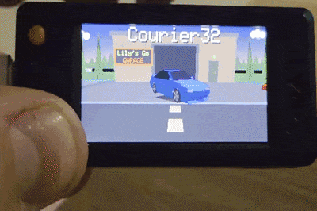

# Courier32

This is a largely vibecoded, open world 3D game with a courier game loop for the **LILYGO ESP32-S3**. It features particle effects, night/day cycle, pedestrians and NPC traffic as well as basic crash physics. You can explore the city with a magnifying glass on the glorious 1.9 inch screen, or you can drive into the glowing beacon and start delivering packages before the timer runs out. 

The project is a demonstration of what is technically possible on the ESP32-S3. I sometimes see people downplaying the capability of these chips, using them at most as a glorified thermostat controls, but they are still full blown miniature computers and are fully capable of simplistic 3D graphics, even with a lack of a dedicated graphical chip.

*There is no documentation, because at this point only God and Claude Fable knows how this slop abomination works.*

## Required Libraries:

Arduino.h

LovyanGFX.hpp

math.h

## Controls:

Left Button: You go left

Right Button: You go right

Both buttons: Breaking

Stop at glowing beacon: Pick up or complete a delivery

## License

The project source code is available under the license in the repository's
`LICENSE` file.

The adapted player-car R32 model data remains subject to the original
Creative Commons Attribution 4.0 license. The original 3D model is available [here](https://sketchfab.com/3d-models/skyline-r32-super-drift-3d-c498ca03fa8b4758996c76b26760d5b9)
and was created by [Aeroux Games 3D](https://sketchfab.com/aerouxgames).

## 3D model attribution

The player-car body is adapted from
[“Skyline R32 – Super Drift 3D”](https://sketchfab.com/3d-models/skyline-r32-super-drift-3d-c498ca03fa8b4758996c76b26760d5b9)
by [Aeroux Games 3D](https://sketchfab.com/aeroux), licensed under
[Creative Commons Attribution 4.0](https://creativecommons.org/licenses/by/4.0/).

The original model was converted into Courier32's custom low-poly C data
format and substantially modified. Changes include revised geometry and
colors, rebuilt separate wheels, glass and pillar adjustments, lighting
details, and integration with the game's software renderer.
